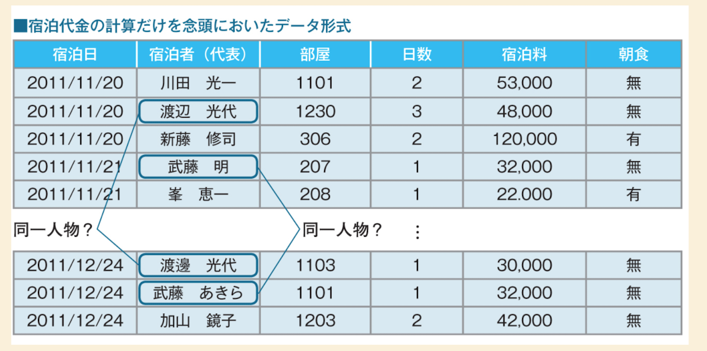

# 概要
このファイルは、データクレンジングの重要性と、そのプロセスにおける代表的な内容、そしてデータベース設計への影響について解説しています。

# データクレンジングの重要性
データクレンジング（Data Cleansing）とは、データベースに登録する前に「汚れたデータ」を調査し、整合性の取れた「きれいな状態」にする作業のことです。

リレーショナルデータベースを最大限に活用し、システム化による業務効率化を図る上で、データクレンジングは非常に重要な第一歩となります。 
データクレンジングが適切に行われない場合、システムが正しく機能しないだけでなく、バッドノウハウやデータの信頼性低下の原因となります。

## データクレンジングは設計に先立って行なう
効率的なシステムを構築するためには、データクレンジングをデータベース設計に先行して行うことが重要です。

-   **業務データの現状調査**: 業務データには、何らかの「汚れ」や不整合が含まれていることがほとんどです。これは、データが古いシステムや手作業で蓄積されたもの、またはフォーマットが統一されていないためです。
-   **入力データフォーマットの調整**: 入力データのフォーマットが適切でない場合、データの変更やフォーマット変換が必要になります。
-   **システム化の準備**: 新たにシステム化する業務や、既存の業務でもリレーショナルデータベース以外の形式でデータが管理されている場合は、リレーショナルデータベースに格納できるフォーマットに変換する作業が必要になります。

## 代表的なデータクレンジングの内容
データクレンジングは多岐にわたりますが、代表的な内容には以下のようなものがあります。

### 同一人物の表記ゆれを統一する
-   例: 「宿泊者（代表）」のデータで、「川田 光一」と「渡辺 光代」が同一人物であるにもかかわらず、異なる表記で登録されている場合など。
-   これは、表記の揺れや誤入力によって発生し、データを正確に集計・分析する上で障害となります。
-   「同じ人物？」の例:
    -   2011/12/24: 渡邉 光代 (1103号室, 30.000円)
    -   2011/12/24: 武藤 あきら (1101号室, 32.000円)
    -   2011/12/24: 加山 諒子 (1203号室, 42.000円)

    このようなデータがあった場合、データクレンジングでは、これらの表記を統一して、同じ人物を識別できるように処理します。

### バックログデータ（過去の履歴データ）を整える
-   過去のシステムから移行するデータや、長期間蓄積された履歴データには、古いフォーマットや誤ったデータが含まれていることがあります。
-   これらのバックログデータもクレンジングの対象となり、新しいシステムで利用できるきれいな状態に整える必要があります。

## データクレンジングのプロセス
データクレンジングの一般的なプロセスは以下のようになります。

1.  **オリジナルのデータ (汚れた状態)**: 収集された生のデータ。
2.  **データフォーマットの調査**: データの形式や内容を詳細に調査し、問題点を特定します。
3.  **データクレンジング**: 調査結果に基づき、データの整形、重複排除、表記ゆれの統一などの処理を行います。
4.  **オリジナルのデータ (きれいな状態)**: クレンジングが完了し、整合性の取れたデータ。
5.  **データベース設計 (論理/物理)**: きれいになったデータに基づき、論理設計と物理設計を行います。本書では、ここが「第1章〜第4章」に相当すると示唆されています。
6.  **データベースへ登録**: 設計されたデータベースにクリーンなデータを登録します。

### データクレンジングの失敗例
データクレンジングを怠ると、システムの運用開始後に様々な問題が発生します。例えば、重複データのために集計結果が誤ったり、検索が正しく機能しなかったりする可能性があります。

### ダブルマスタ
-   複数のシステムで同じ種類のマスタデータをそれぞれ管理している状態を「ダブルマスタ」と呼びます。
-   新しいシステムを導入する際に、旧システムのマスタデータを移行せず、並行して運用することで発生することがあります。
-   例: 新システムにマスタAとマスタBが存在し、旧システムAがマスタAを持ち、旧システムBがマスタBを持つ。

このような状況では、データの一貫性を保つのが難しく、システムの複雑性が増大します。データクレンジングは、このような課題を未然に防ぎ、システムの健全性を保つ上で不可欠な作業です。