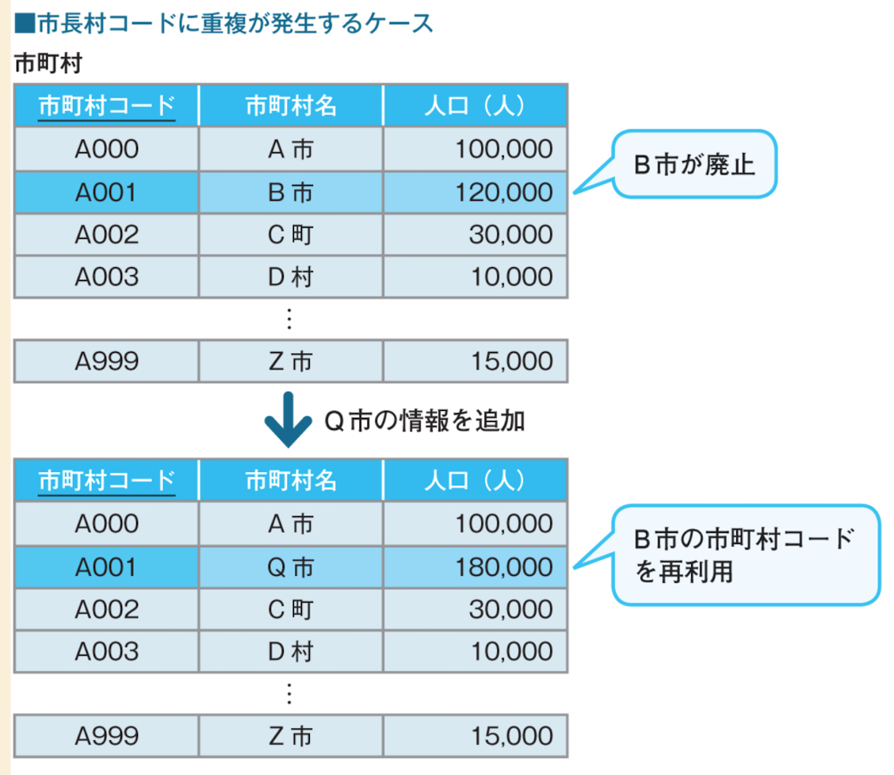
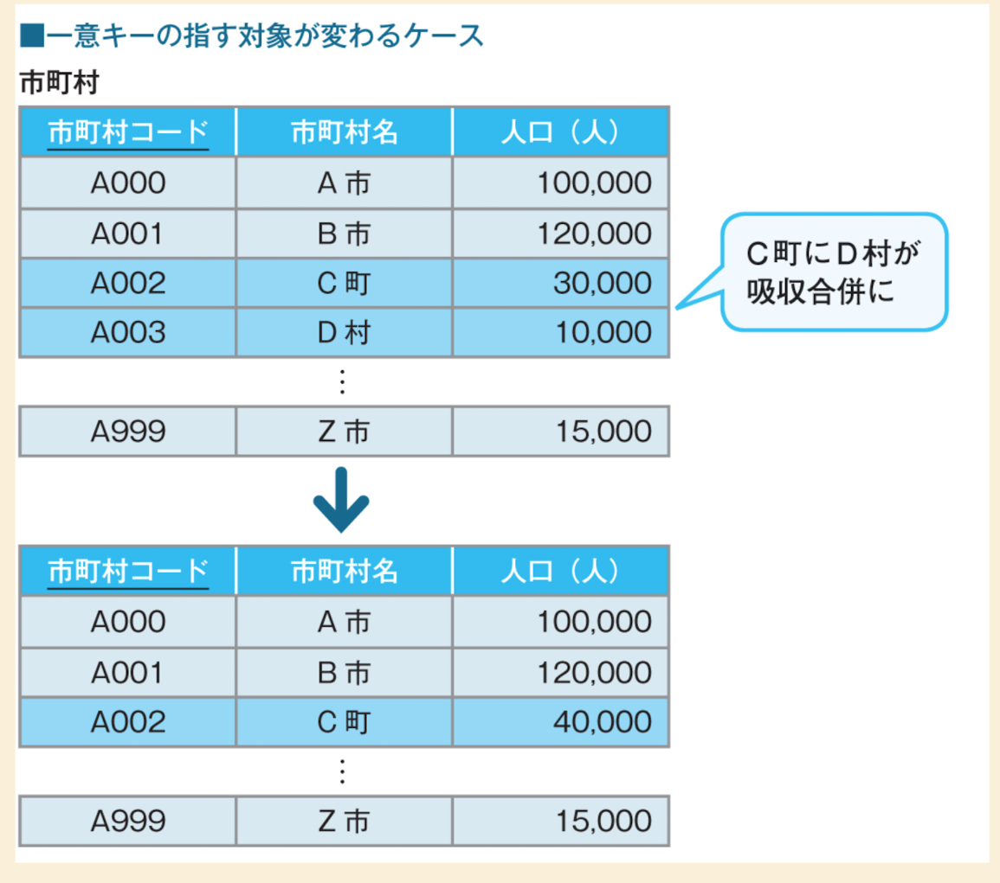
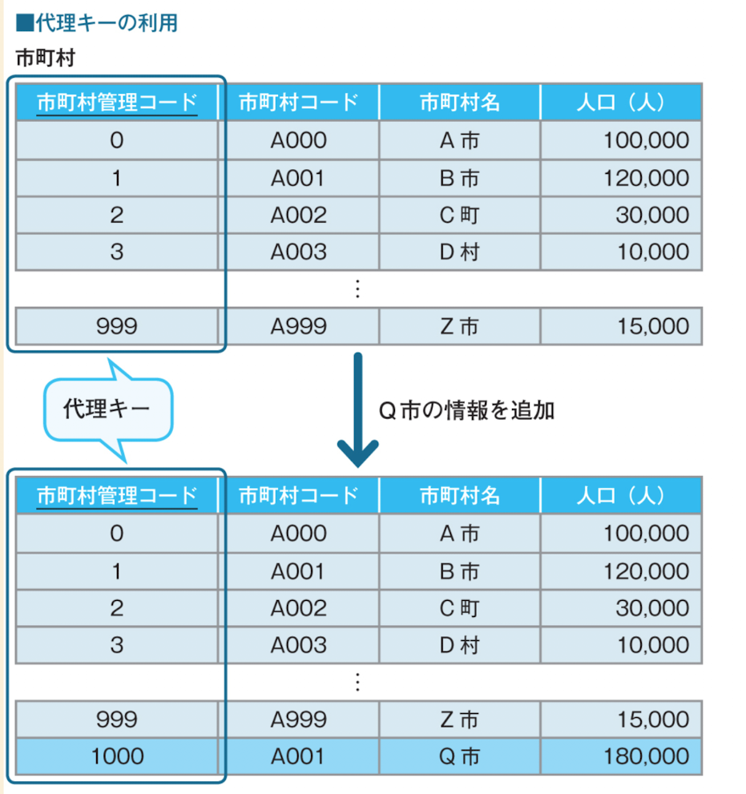
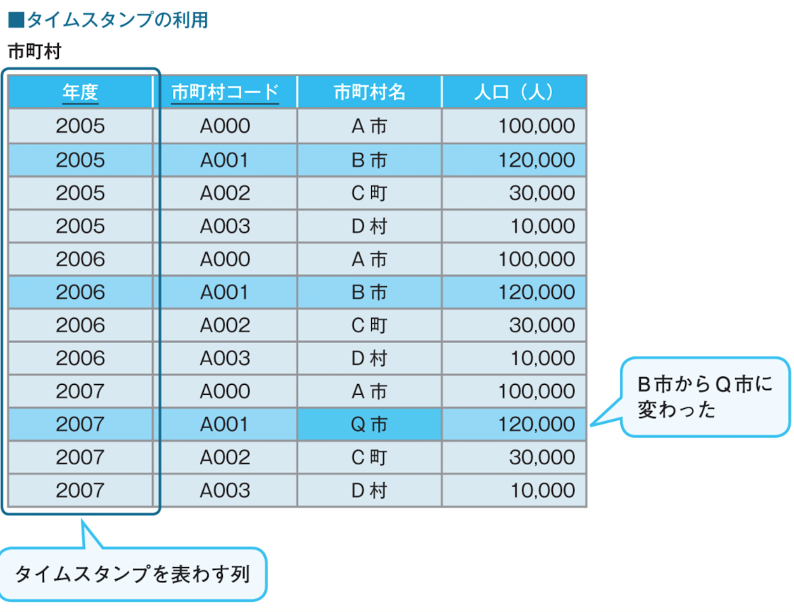
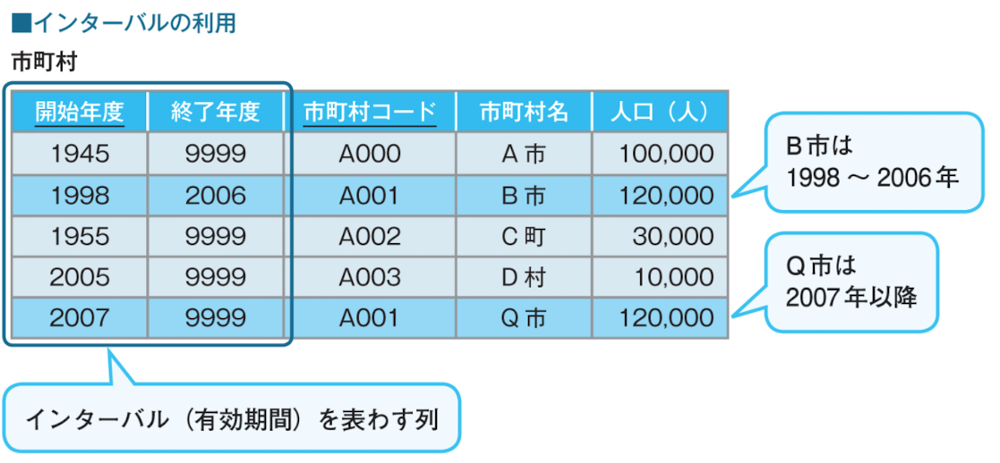

# 概要

このファイルはSQLアンチパターンではないが、デメリットも存在するグレーノウハウの代理キーについて記載しています。

# 代理キーとは何か？

添付画像の通り、仕様の制約で主キーの値を増やせない場合に代理キーを使い回すことをいいます。
（添付画像では、市町村コードが999移行増やせない仕様となっています）

# 解決案
## 代理キーを使用する
サロゲートキーと言われる、入力データに最初から存在しているキー［※3］の「代理」として新たに追加するキーです。

## 自然キーによる解決
代理キーはDB側で管理するため、楽で良いですが、、 
オートナンバーを使用することはセキュリティや代理キー自体が何を示しているのか把握することができないため 
使用しない方が良いとする考えがあります。

その代替え案として、元々DBに入力する時の値で存在する自然キーを使用する方法があります。

1. タイムスタンプを使用する方法
添付画像の通り、登録した年度をタイムスタンプとして活用する方法です。

データの形式が単純なので利用する際も、SQLの条件が簡単になるなど、そのシンプルさにあります。 
一方、必ず一つのスナップショットに含まれる市町村をフルセットで保持しなければならないので、レコード数が増えます。 
特に、1年に1回程度の変更ならまだ良いのですが、毎月や毎週変更されるようなデータの場合は、レコード数が膨大になってしまうでしょう。

2. インターバル
これは、先ほどのタイムスタンプがある「時点」を意味したのに対し、データの有効な「期間」を表わす方法です。

今度は、「開始年度」と「終了年度」という二つの時間列を持つことで、データの有効期間を示しています。 
終了年度に「9999」という最大値を入力している市町村は、まだ存続していることを示しています。 
この場合、NULLを使っても良いのですが、SQLでの使い勝手を考えると、入力上許される最大値を利用するほうが便利です。 

このインターバル方式は、タイムスタンプ方式の欠点を克服できます。 
スナップショット別にデータを持つ必要はなく、データの有効期間が切れたら既存のレコードの「終了年度」に終了期限を入力するだけなので、 
全体としてレコード数を少なく抑えられます。これはデータ変更が頻繁に発生する場合には大きな利点です。 

一方の欠点は、データを利用する際に、SQLで必ず範囲指定の条件を入れる必要があるので、SQLが少し複雑になることです。

