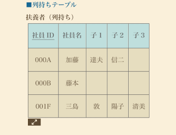
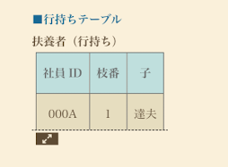

# 概要
このファイルにはデータベース設計における「列持ちテーブル」と「行持ちテーブル」の特徴、利点、欠点について記載しています。

# 列持ちテーブルの利点と欠点

## 列持ちテーブルとは
列持ちテーブルは、特定の情報を新しい「列」（カラム）として追加していく形式のテーブルです。例えば、ユーザーの属性が増えるたびに新しい列を追加していくような構造です。

## 利点
- **単純性**: 新しい情報を追加する際に、新しい列を追加するだけで済み、構造が理解しやすい。
- **データ型の一貫性**: 各列に特定のデータ型（数値、文字列など）を設定できるため、データの一貫性が保たれやすい。
- **結合の容易さ**: 複数のテーブルを結合する際に、共通のキーを基に結合しやすい。
- **SQLクエリの記述しやすさ**: 特定の列を指定してデータを取得・更新するクエリが直感的に記述しやすい。

## 欠点
- **柔軟性の欠如**: 新しい属性（情報）が増えるたびにテーブル構造を変更する必要があり、スキーマの変更が頻繁になる。これは運用上の手間やシステム停止の原因となる可能性がある。
- **列数の増加**: 属性の種類が多くなると、テーブルの列数が非常に多くなり、管理が複雑になる。
- **NULL値の多発**: すべての行がすべての属性を持つわけではない場合、多くのNULL値（データがないことを示す）が発生し、ストレージの無駄やクエリの複雑化を招く可能性がある。
- **スキーマ変更のコスト**: 大規模なテーブルで列を追加・削除する操作は、パフォーマンスに大きな影響を与える場合がある。

# 行持ちテーブル

## 行持ちテーブルとは
行持ちテーブルは、新しい情報を新しい「行」（レコード）として追加していく形式のテーブルです。属性の種類が増えても、新しい行として情報を格納するため、テーブルの列数は固定される傾向にあります。これは、特に属性が頻繁に追加・変更されるような場合に有効です。

列持ちテーブルと比較するとデメリットが少ないため、列持ちテーブルを作成する際は、行待ちテーブルを作成するようにすること！！

## 利点
- **高い柔軟性**: 新しい属性が追加されてもテーブル構造を変更する必要がなく、スキーマの変更コストが低い。
- **列数の安定**: 属性の種類が増えても列数は一定に保たれるため、テーブルの管理が比較的容易。
- **スパースデータの効率的な格納**: すべての行がすべての属性を持つ必要がないため、NULL値の発生を抑え、ストレージを効率的に利用できる。
- **動的な属性追加**: アプリケーション側で動的に属性を追加・管理するシステムに適している。

## 欠点
- **データの取得が複雑**: 特定の属性値を取得するために、行をフィルタリングするなどの操作が必要になり、クエリが複雑になることがある。
- **パフォーマンスの低下**: 大量の行の中から特定の属性を探す場合、フルスキャンが必要になることがあり、パフォーマンスが低下する可能性がある。
- **データ型の一貫性の問題**: 1つの列に複数の異なるデータ型の値が格納されることがあり、データ型の一貫性を保つのが難しい場合がある（例: 値をすべて文字列で格納するなど）。
- **集計の困難さ**: 特定の属性に対する集計（平均、合計など）を行う場合、ピボット操作など追加の処理が必要になることがある。