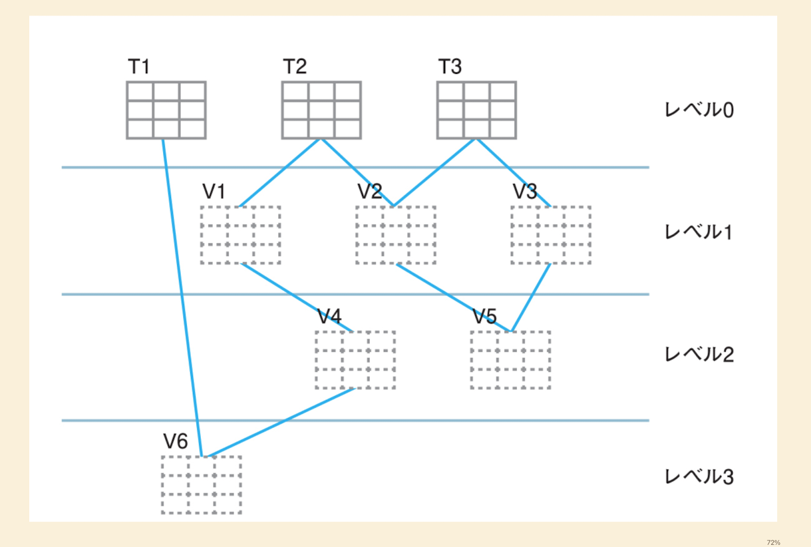

# 概要
このファイルには、データベースにおける多段ビューの概念とその設計上の注意点について記載されています。

# 多段ビュー
ビューは、リレーショナルデータベースを用いた開発において非常に有用な道具です。

`SELECT`文を保存し、一つのテーブルとして扱うことができるため、複雑な正規化されたテーブルの結合や、複雑な操作を伴う`SELECT`文をビューとしておくことで、上位レイヤーのプログラミングを簡潔に行えるという利点があります。

## ビューへのアクセスは「2段階」で行われる
ビューはテーブルと異なり、実データを保持しません。ビューへのアクセスは以下の2段階で行われます。

1.  ユーザーからビューへの`SELECT`文が発行される。
2.  ビューの定義に基づき、ビューが参照している元のテーブルに対して`SELECT`文が実行される。

この2段階のアクセスが行われるため、ビューを介してデータを取り出す際には、常にオリジナルのテーブルへのアクセスが発生します。ビューは、あくまでも「仮想テーブル」または「論理テーブル」と呼ぶべきものです。

## 多段ビューの危険性
ビューは複数のテーブルを結合して作成されることがあります。さらに、作成されたビューを基に別のビューを作成することも可能です。このように、ビューを多段階で作成していくことを「多段ビュー」と呼びます。

しかし、多段ビューの設計には注意が必要です。

-   **複雑化**: ビューの階層が深くなるほど、データの流れや依存関係が複雑になり、理解やメンテナンスが難しくなります。
-   **パフォーマンスの低下**: ビューがさらに別のビューを参照し、それがまた別のビューやテーブルを参照するという多段構造になると、最終的なデータの取得までに多数の`SELECT`文が連鎖的に実行されることになります。これにより、パフォーマンスが著しく低下する可能性があります。

多段ビューの例として、以下のような階層構造が考えられます。

-   **レベル0**: オリジナルのテーブル（T1, T2, T3）
-   **レベル1**: レベル0のテーブルを参照するビュー（V1, V2, V3）
-   **レベル2**: レベル1のビューを参照するビュー（V4, V5）
-   **レベル3**: レベル2のビューを参照するビュー（V6）

このように、ユーザーがレベル3のビュー（V6）にアクセスした場合、最終的にはレベル0の複数のテーブルにまでアクセスが波及し、それに伴う処理コストが増大する可能性があります。

### 設計上の注意
-   ビューの階層を必要以上に深くしない。
-   パフォーマンスが懸念される場合は、ビューの定義を見直し、直接テーブルにアクセスする、あるいはマテリアライズドビュー（実体化されたビュー）の利用を検討するなど、設計を最適化する必要がある。