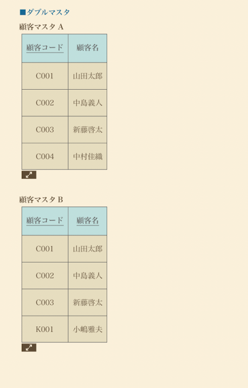

# 概要

このファイルは、SQLアンチパターンの一つダブルマスタについて記載しています。

# ダブルマスタとは何か？

同じ役割のマスタテーブルが二つ存在することをいいます。

この状態になるとマスタ情報を取得する際に必ず結合が必要になり、データ取得にパフォーマンスが悪くなります。

# なぜ発生するのか？

システムを統合する際に、それぞれのマスタを統合しなかった場合に発生するようです。 
銀行とか多そう。

