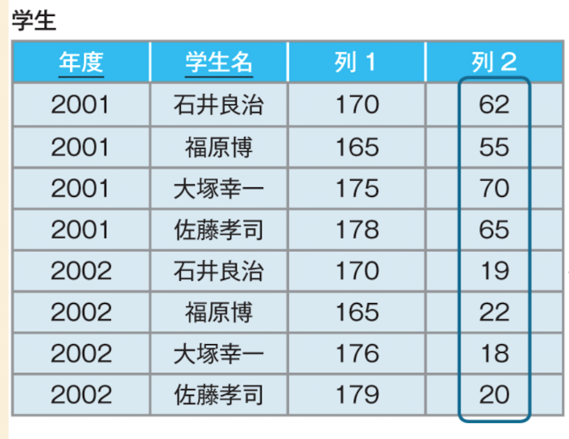

# 概要

このページは、SQLアンチパターンのダブルミーニングについて記述しています。

# ダブルミーニングとは何か？

一つのカラムに複数の概念の値が存在することをいいます。
画像の列2がダブルミーニング状態です。一つのカラムの中に複数の値が入っていることを非スカラ値といいます。

列2は途中までは体重について記載していますが、途中から年齢に変わっています。 
この状態ですと、DBから取得した値が何か判定することが難しく、アプリケーション側での制御が大変です。

よって使用しないほうが良いとされています。 
※別の概念を取り扱う場合、別カラムを用意すべき

