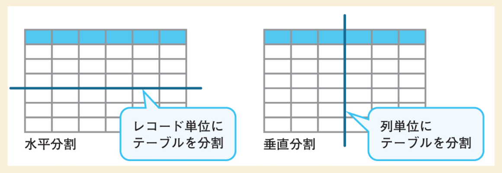

# 概要

このファイルは、SQLアンチパターンの一つテーブル分割について記載しています。

# テーブル分割とは何か？

テーブル分割とは、添付画像の通りテーブルを水平や垂直に分割する方法のことをいいます。

テーブルを分割することで検索時のデータ量を減らすことができ、パフォーマンスの改善を期待することができますが.. 
拡張性が乏しく、他の代替手段があるため使用しないほうがいいとされています。

# 代替手段

テーブル分割の代替手段に、列の絞り込み（データマート ）とサマリテーブルを作成する方法があります。

どちらの方法も元のテーブルは変更せずに、必要な情報を別テーブルに書き出しています。

これはとても便利なのですが、データを同期する問題があり、頻繁に同期するとパフォーマンスの問題が発生する可能性があり 
同期の頻度を落とすと、データの整合性が落ちてしまいます。 

要件と相談になりますが、基本的に同期は一回から数回にしておくことがベターのようです。

