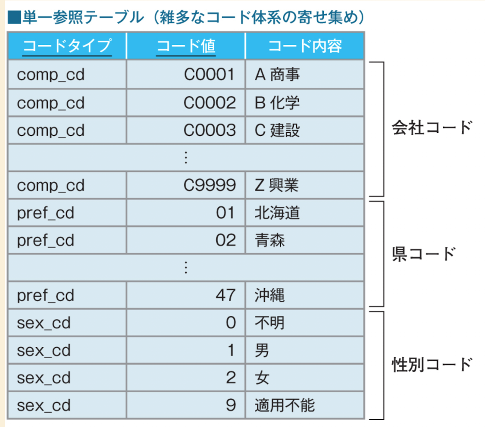

# 概要

このページは、SQLアンチパターンの単一参照テーブルについて記述しています。

# 単一参照テーブルとは何か？

似たようなテーブル構造をしているものを一つにまとめて、一つのテーブルに複数の概念が存在することをいいます。 
画像では、会社コード、県コード、性別コードがまとめられています。

一応メリットがありますが、デメリットの方がよく使用しない方が良いとされています。

- 利点 
  - マスタテーブルの数が減るため、ER図やスキーマがシンプルになる。 
  - コード検索のSQLを共通化できる。

- 欠点 
  - 「コードタイプ」「コード値」「コード内容」の各列とも、必要とされる列長はコード体系によって異なるため、余裕を見てかなり大きめの可変長文字列型で宣言する必要がある。
  - 一つのテーブルにレコードを集約するため、コード体系の種類と数の多さによっては、レコード数が多くなり、検索のパフォーマンスが悪化する。 
  - コード検索のSQL内でコードタイプやコード値を間違えて指定してもエラーになることがないため、バグに気付きにくい。 
  - ER図がすっきりするとはいっても、ERモデルとしては正確さを欠いており、かえってER図の可読性を下げることになる。

同じテーブルではなく、別テーブルで管理するようにした方がいい。

