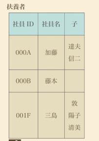

# 概要

このページは、SQLアンチパターンの非スカラ値について記述しています。

# 非スカラ値とは何か？

画像の通り、一つのカラムの中に複数の値が入っていることを非スカラ値といいます。
この状態ですと、DBから取得した値が複数あるのかないのか判定が必要になり、アプリケーション側での制御が大変です。
よって使用しないほうが良いとされています。
※DBの機能としては、非スカラ値の配列型をサポートしているが、あまり普及していない。

